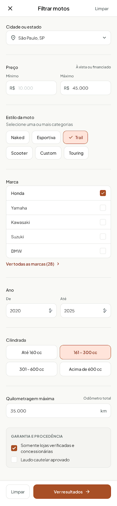
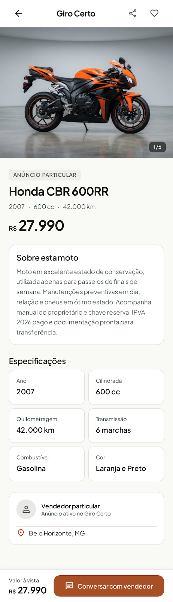
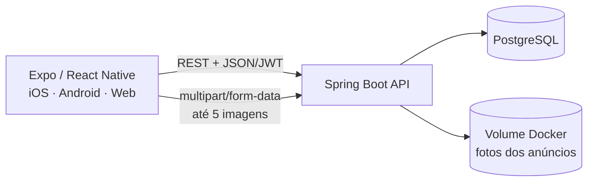

# Giro Certo — redesign e atualização 2026

> **Giro Certo começou como um projeto em 2021.** Este repositório apresenta sua atualização de 2026: um redesign da interface e da experiência de uso, junto da modernização da aplicação mobile, da API e do ambiente de execução.

A proposta continua simples: ajudar pessoas a encontrar e anunciar motocicletas. Nesta edição, o layout, a navegação e os fluxos foram reorganizados para deixar as informações mais fáceis de ler e as ações principais mais diretas, do catálogo à publicação de um anúncio.

## Da versão de 2021 à edição de 2026

| Etapa | Direção do projeto |
| --- | --- |
| **2021 · projeto original** | Primeira versão do Giro Certo e ponto de partida para a atualização. |
| **2026 · redesign** | Revisão de layout, hierarquia visual, navegação e telas para uma experiência mobile mais clara e consistente. |
| **2026 · atualização técnica** | Aplicativo React Native com Expo, API Java/Spring Boot, PostgreSQL e serviços locais via Docker Compose. |

O redesign considera o fluxo completo de quem compra e de quem anuncia: explorar e filtrar motos, consultar detalhes, guardar favoritos, editar o perfil e publicar um anúncio com fotos. A paleta, a tipografia e os padrões visuais estão descritos em [`DESIGN.md`](DESIGN.md).

## Telas do projeto

As imagens abaixo mostram o redesign do Giro Certo para 2026: autenticação, catálogo de motos, filtros de busca e detalhes de um anúncio. Elas documentam a direção visual e os principais fluxos do projeto.

<p align="center">
  
  
</p>
<p align="center">
  
  
</p>

> As telas representam o projeto e sua proposta de UI/UX. Os dados de anúncios exibidos nelas são ilustrativos.

## O que foi atualizado em 2026

- **Layout e UI/UX:** telas de início, detalhes, favoritos, publicação, login e perfil redesenhadas; navegação, hierarquia das informações e estados de interface revistos.
- **Catálogo:** busca, filtros e cards com dados essenciais da moto; a imagem do card se ajusta à proporção da foto.
- **Anúncios:** seleção, pré-visualização e remoção de até **5 fotos** antes de publicar; galeria na tela de detalhes.
- **Perfil e conta:** cadastro e login, edição de nome e e-mail e troca de senha com validação da senha atual.
- **Plataforma:** aplicativo multiplataforma em React Native/Expo e API Java com Spring Boot, PostgreSQL, JWT e armazenamento persistente de imagens.

### Diretrizes de experiência

- **Mobile-first:** ações importantes ficam acessíveis em telas pequenas, com navegação consistente entre início, favoritos, anúncio e perfil.
- **Leitura rápida:** preço, modelo, ano, cilindrada, quilometragem e localização aparecem organizados para facilitar a comparação entre anúncios.
- **Ações previsíveis:** filtros, favoritos, galeria e formulário de publicação seguem padrões visuais comuns.
- **Feedback de interface:** carregamento, erros, resultados vazios e indisponibilidade da API têm estados próprios.
- **Publicação com contexto:** as fotos selecionadas são pré-visualizadas e podem ser removidas antes do envio.

## Funcionalidades

### Catálogo

- Lista de motos com imagens, preço, ano, cilindrada, quilometragem e localização.
- Busca e filtros por categoria, marca, preço, ano, cilindrada, quilometragem e cidade.
- Tela de detalhes com galeria de fotos, especificações, vendedor e compartilhamento.
- Catálogo local de demonstração para manter a navegação disponível quando a API estiver fora do ar.

### Conta e anúncios

- Cadastro e login com senha protegida por BCrypt e sessão autenticada por JWT.
- Edição de nome e e-mail no perfil; a troca de senha pede a senha atual e confirmação da nova senha.
- Favoritos locais para visitantes e sincronizados com a conta autenticada.
- Publicação de anúncios com dados da motocicleta e até cinco imagens.

### Interface

- React Native com Expo Router para iOS, Android e web.
- React Native Paper (Material Design 3) e NativeWind/Tailwind para componentes e estilos.
- Layout responsivo, estados de carregamento, mensagens de erro e estados vazios.

## Tecnologias

| Camada | Tecnologias |
| --- | --- |
| Aplicativo | React Native 0.86, Expo SDK 57, TypeScript, Expo Router |
| UI | React Native Paper, NativeWind, Tailwind CSS, Plus Jakarta Sans |
| Fotos | Expo ImagePicker, envio `multipart/form-data`, volume persistente |
| API | Java 21, Spring Boot 3.5, Spring Security, Spring Data JPA |
| Dados | PostgreSQL 17 |
| Execução local | Docker Compose |

## Arquitetura



## Executar localmente

### Requisitos

- Node.js 22.13 ou superior e npm.
- Docker Desktop com Docker Compose.
- Expo Go para execução rápida em um dispositivo, ou emulador Android/iOS.
- Xcode é necessário para gerar e executar builds nativos de iOS.

### 1. Preparar as variáveis locais

Na raiz do projeto:

```bash
cp .env.example .env
```

Os valores do arquivo de exemplo servem para desenvolvimento local. Antes de publicar a API, configure uma senha PostgreSQL, um `JWT_SECRET` aleatório com pelo menos 32 caracteres e uma lista explícita de origens em `CORS_ALLOWED_ORIGINS`.

### 2. Subir API e banco

```bash
docker compose up --build -d
```

O Compose inicia a API na porta `8082` e o PostgreSQL na porta `5432`. A API cria as tabelas e adiciona anúncios de demonstração se o catálogo estiver vazio.

Confirme a disponibilidade:

```bash
curl http://localhost:8082/api/health
```

O Compose mantém banco e fotos em volumes nomeados, `giro_certo_data` e `giro_certo_photo_storage`. Reiniciar ou reconstruir os containers preserva esses arquivos.

### 3. Iniciar o aplicativo

```bash
cd mobile
npm ci
cp .env.example .env
npm run web -- --port 8090
```

Abra `http://localhost:8090`. Para iniciar o Expo sem abrir a versão web:

```bash
npm run start
```

No terminal do Expo, pressione `a` para Android ou `i` para iOS. Também é possível executar `npm run android` ou `npm run ios`.

### Endereço da API por dispositivo

O app escolhe um endereço local padrão:

| Ambiente | Endereço |
| --- | --- |
| Web e simulador iOS | `http://localhost:8082/api` |
| Emulador Android | `http://10.0.2.2:8082/api` |
| Celular físico | `http://<IP_DO_COMPUTADOR_NA_REDE>:8082/api` |

Para um celular físico, informe o IP local do computador em `mobile/.env`:

```dotenv
EXPO_PUBLIC_API_URL=http://192.168.1.25:8082/api
```

O celular e o computador precisam estar na mesma rede. Se alterar configurações de `app.json`, reinicie o Expo para recarregar a configuração.

## API REST

As respostas são JSON, exceto os arquivos de imagem. Rotas marcadas como autenticadas esperam `Authorization: Bearer <token>`.

| Método | Rota | Acesso | Descrição |
| --- | --- | --- | --- |
| `GET` | `/api/health` | Público | Verifica disponibilidade da API |
| `GET` | `/api/motorcycles` | Público | Lista anúncios; aceita filtros por query string |
| `GET` | `/api/motorcycles/{id}` | Público | Consulta um anúncio e suas fotos |
| `POST` | `/api/motorcycles` | Autenticado | Publica anúncio em JSON ou `multipart/form-data` |
| `GET` | `/api/uploads/{fileName}` | Público | Entrega uma foto pública de anúncio |
| `POST` | `/api/auth/register` | Público | Cria uma conta |
| `POST` | `/api/auth/login` | Público | Autentica e retorna JWT |
| `GET` | `/api/auth/me` | Autenticado | Consulta o perfil atual |
| `PUT` | `/api/auth/me` | Autenticado | Atualiza nome, e-mail e, opcionalmente, senha |
| `GET` | `/api/favorites` | Autenticado | Lista favoritos sincronizados |
| `POST` | `/api/favorites/{motorcycleId}` | Autenticado | Adiciona favorito |
| `DELETE` | `/api/favorites/{motorcycleId}` | Autenticado | Remove favorito |

O endpoint `POST /api/motorcycles` recebe os campos do anúncio e repete o campo `photos` para cada arquivo. O servidor aplica o limite de cinco fotos e 10 MB por foto, identifica os formatos pelo conteúdo e retorna as URLs em `imageUrls`; `imageUrl` continua apontando para a foto principal por compatibilidade.

## Estrutura do repositório

```text
.
├── backend/
│   ├── Dockerfile
│   ├── pom.xml
│   └── src/main/java/br/com/girocerto/api/
├── mobile/
│   ├── app/                 # Telas e rotas Expo Router
│   ├── components/          # Componentes reutilizáveis
│   ├── lib/                 # API, autenticação, tema e estado
│   └── package.json
├── compose.yaml             # API, PostgreSQL e volumes
├── DESIGN.md                # Sistema visual e decisões de UI
└── README.md
```

## Verificações de desenvolvimento

```bash
cd mobile
npm run typecheck
npx expo export --platform web
```

```bash
cd backend
mvn -DskipTests package
```

## Segurança e configuração

- Senhas são armazenadas com BCrypt e as rotas privadas validam JWT.
- No app nativo, o token é salvo com Expo SecureStore; a versão web mantém a sessão apenas em memória.
- O upload aceita somente arquivos que correspondam a JPEG, PNG ou WebP, com nomes aleatórios gerados no servidor e limites de tamanho e quantidade.
- Os arquivos são servidos como imagens com `X-Content-Type-Options: nosniff`.
- Segredos, configurações `.env`, dependências instaladas e saídas de build estão excluídos pelo `.gitignore`. Use `.env.example` como modelo, nunca como repositório de credenciais reais.

## Solução de problemas

**O app não alcança a API no celular:** use o IP LAN do computador em `mobile/.env`; `localhost` no celular aponta para o próprio aparelho.

**A API não inicia:** confira `docker compose ps` e `docker compose logs backend database`. O backend aguarda o health check do PostgreSQL.

**As fotos não aparecem depois de reiniciar:** confirme que o serviço `backend` continua usando o volume `giro_certo_photo_storage` no `compose.yaml`.

**Alterou variáveis do Expo:** reinicie o servidor Expo para que `EXPO_PUBLIC_API_URL` seja carregada novamente.
